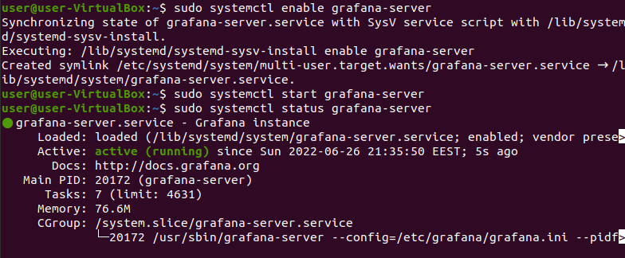

# Podobailo Andrii DEVOPS Crash Course #12

Installing Prometheus

Prometheus config file

Prometheus start service

Prometheus running :9090 port

Added prometheus plugin to Jenkins

Installing Grafana

Grafana starting :3000 port

Grafana Login

Grafana adding prometheus

Grafana adding graph with params of prometheus

